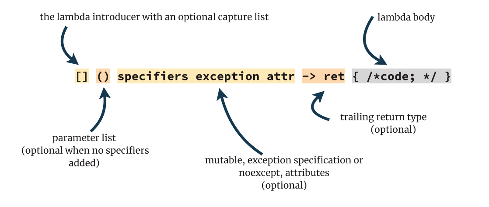

# 1. Lambda dalam C++98/03

Untuk memulai, ada baiknya membuat latar belakang untuk topik utama kita. Untuk melakukan ini, kita akan mundur ke masa lalu dan melihat kode yang tidak menggunakan teknik C++ modern - yang berarti Spesifikasi C++98/03.

Dalam bab ini, Anda akan mempelajari:

- Bagaimana cara meneruskan objek fungsi ke algoritma dari Pustaka Standar dengan cara "lama".
- Keterbatasan tipe kelas objek fungsi.
- Mengapa pembantu fungsional (functional helpers) tidak cukup baik.
- Motivasi untuk lambda pada C++0x/C++11.

# Objek Callable dalam C++98/03

Salah satu ide fundamental dari Pustaka Standar adalah bahwa algoritma seperti `std::sort`, `std::for_each`, `std::transform`, dan banyak lainnya, dapat menerima objek callable (dapat dipanggil) dan memanggilnya pada elemen-elemen dari kontainer masukan. Namun, dalam C++98/03, ini hanya mencakup pointer fungsi atau tipe kelas dengan operator pemanggil (call operator) yang biasa disebut sebagai "functor".

Sebagai contoh, mari kita lihat sebuah aplikasi yang mencetak semua elemen dari sebuah vektor.

Pada versi pertama, kita akan menggunakan fungsi reguler:

**Ex1_1: Fungsi cetak dasar.** *(Kode langsung di Wandbox)*

```cpp
#include <algorithm>
#include <iostream>
#include <vector>

void PrintFunc(int x) {
    std::cout << x << '\n';
}

int main() {
    std::vector<int> v;
    v.push_back(1); // tidak ada inisialisasi seragam di C++03!
    v.push_back(2); // push_back hanya tersedia... :)
    std::for_each(v.begin(), v.end(), PrintFunc);
}
```

Kode di atas menggunakan `std::for_each` untuk mengiterasi vektor (kita menggunakan C++98/03 sehingga range-based for loop tidak tersedia!) dan kemudian meneruskan `PrintFunc` sebagai objek callable.

Kita dapat mengubah fungsi ini menjadi tipe kelas dengan operator pemanggil:

**Ex1_2: Tipe objek fungsi cetak dasar.** *(Kode langsung di Wandbox)*

```cpp
#include <algorithm>
#include <iostream>
#include <vector>

struct Printer {
    void operator()(int x) const {
        std::cout << x << '\n';
    }
};

int main() {
    std::vector<int> v;
    v.push_back(1);
    v.push_back(2); // tidak ada inisialisasi daftar di C++98/03...
    std::for_each(v.begin(), v.end(), Printer());
}
```

Contoh di atas mendefinisikan sebuah `struct` dengan `operator()` sehingga Anda dapat "memanggil" objek ini seperti fungsi reguler:

```cpp
Printer printer;
printer(5); // memanggil operator() dengan argumen 5
printer.operator()(10); // pemanggilan yang setara dengan argumen 10
```

Sementara fungsi non-anggota biasanya tidak memiliki status (stateless)¹, tipe kelas seperti fungsi dapat memiliki anggota data non-statis yang memungkinkan penyimpanan status. Salah satu contohnya adalah menghitung jumlah pemanggilan (invocations) dari sebuah objek callable dalam sebuah algoritma. Solusi ini membutuhkan penghitung (counter) yang diperbarui dengan setiap pemanggilan:

**Ex1_3: Objek fungsi dengan status.** *(Kode langsung di Wandbox)*

```cpp
#include <algorithm>
#include <iostream>
#include <vector>

struct PrinterEx {
    PrinterEx(): numCalls(0) { }

    void operator()(int x) {
        std::cout << x << '\n';
        ++numCalls;
    }

    int numCalls;
};

int main() {
    std::vector<int> v;
    v.push_back(1);
    v.push_back(2);
    const PrinterEx vis = std::for_each(v.begin(), v.end(), PrinterEx());
    std::cout << "num calls: " << vis.numCalls << '\n';
}
```

Dalam contoh di atas, ada anggota data `numCalls` yang digunakan untuk menghitung jumlah pemanggilan operator. `std::for_each` mengembalikan objek fungsi yang kita berikan, sehingga kita dapat mengambil objek ini dan mendapatkan nilai dari anggota datanya.

Seperti yang dapat Anda prediksi, kita akan mendapatkan output sebagai berikut:

```
1
2
num calls: 2
```

Kita juga dapat "menangkap" (capture) variabel dari lingkup pemanggilan. Untuk melakukan itu, kita harus membuat anggota data dalam objek fungsi kita dan menginisialisasinya di konstruktor.

**Ex1_4: Objek fungsi dengan variabel 'tertangkap'.** *(Kode langsung di Wandbox)*

```cpp
#include <algorithm>
#include <iostream>
#include <string>
#include <vector>

struct PrinterEx {
    PrinterEx(const std::string& str) : strText(str), numCalls(0) { }

    void operator()(int x) {
        std::cout << strText << x << '\n';
        ++numCalls;
    }

    std::string strText;
    int numCalls;
};

int main() {
    std::vector<int> v;
    v.push_back(1);
    v.push_back(2);
    const std::string introText("Elem: ");
    const PrinterEx vis = std::for_each(v.begin(), v.end(), PrinterEx(introText));
    std::cout << "num calls: " << vis.numCalls << '\n';
}
```

Dalam versi ini, `PrinterEx` menerima parameter tambahan untuk menginisialisasi anggota data. Kemudian variabel ini digunakan dalam operator pemanggil dan output yang diharapkan adalah sebagai berikut:

```
Elem: 1
Elem: 2
num calls: 2
```

¹Anda dapat menggunakan variabel global atau variabel statis dalam fungsi reguler, tetapi ini bukan solusi terbaik. Pendekatan seperti itu membuat sulit untuk mengontrol status di berbagai kelompok pemanggilan lambda.

# Apa itu "Functor"?

Beberapa bagian di atas saya menyebutkan bahwa tipe kelas dengan `operator()` kadang-kadang disebut sebagai "functor". Meskipun istilah ini praktis dan jauh lebih pendek dibandingkan "tipe kelas objek fungsi", sebenarnya ini tidak benar.

Ternyata, "Functor" berasal dari pemrograman fungsional, dan memiliki makna yang berbeda dibandingkan dengan penggunaan sehari-hari di C++.

Mengutip Bartosz Milewski tentang Functors²:

> *A functor is a mapping between categories. Given two categories, C and D, a functor F maps objects in C to objects in D — it’s a function on objects.*

Ini sangat abstrak, tetapi untungnya, kita juga dapat melihat definisi yang lebih sederhana. Dalam bab 10 dari *"Functional Programming in C++"*³, Ivan Cukic "menerjemahkan" definisi abstrak tersebut menjadi lebih praktis untuk C++:

> *A class template F is a functor if it has a transform (or map) function defined on it. Also, such a transform function must obey two rules about identity and composition.*

Istilah "Functor" tidak ada dalam bentuk apa pun dalam Spesifikasi C++ (bahkan dalam C++98/03), oleh karena itu untuk sisa buku ini, kita akan mencoba menghindarinya.

Saya merekomendasikan sumber berikut untuk membaca lebih lanjut tentang Functors:

- [Functors, Applicatives, And Monads In Pictures - adit.io](https://adit.io/posts/2013-04-17-functors,_applicatives,_and_monads_in_pictures.html)
- [Functors | Bartosz Milewski’s Programming Cafe](https://bartoszmilewski.com/2015/01/20/functors/)
- [What are C++ functors and their uses? - Stack Overflow](https://stackoverflow.com/questions/356950/what-are-c-functors-and-their-uses)
- [Functor - Wikipedia](https://en.wikipedia.org/wiki/Functor)

² [https://bartoszmilewski.com/2015/01/20/functors/](https://bartoszmilewski.com/2015/01/20/functors/)

³ *"Functional Programming in C++: How to improve your C++ programs using functional techniques 1st Edition"* @Amazon

# Masalah dengan Tipe Kelas Objek Fungsi

Seperti yang dapat Anda lihat, membuat tipe kelas dengan operator pemanggil sangatlah kuat. Anda memiliki kontrol penuh, dan Anda dapat merancangnya sesuai keinginan.

Namun, di C++98/03, masalahnya adalah Anda harus mendefinisikan tipe objek fungsi di tempat yang berbeda dari pemanggilan algoritma. Ini bisa berarti bahwa callable (objek yang dapat dipanggil) bisa berada puluhan atau ratusan baris lebih awal atau lebih jauh dalam file sumber, atau bahkan di unit kompilasi yang berbeda.

Sebagai solusi potensial, Anda mungkin mencoba menulis kelas lokal, karena C++ selalu mendukung sintaks tersebut. Tetapi ini tidak berhasil dengan template.

Lihat kode ini:

### Tipe Objek Fungsi Lokal
```cpp
int main() {
    struct LocalPrinter {
        void operator()(int x) const {
            std::cout << x << '\n';
        }
    };
    std::vector<int> v(10, 1);
    std::for_each(v.begin(), v.end(), LocalPrinter());
}
```

Cobalah untuk mengompilasinya dengan `-std=c++98` dan Anda akan melihat kesalahan berikut di GCC:

```
error: template argument for 
' template<class _IIter, class _Funct> _Funct 
std::for_each(_IIter, _IIter, _Funct)' 
menggunakan tipe lokal 'main()::LocalPrinter'
```

Seperti yang terlihat, di C++98/03, Anda tidak bisa menginstansiasi template dengan tipe lokal.

Programmer C++ dengan cepat memahami keterbatasan ini dan menemukan cara untuk mengatasi masalah tersebut dengan C++98/03. Salah satu solusinya adalah dengan mempersiapkan serangkaian *helpers* (pembantu). Mari kita tinjau mereka di bagian berikutnya.

# Menggabungkan Dengan *Functional Helpers*

Bagaimana jika kita memiliki beberapa *helpers* (pembantu) dan objek fungsi yang telah ditentukan sebelumnya?

Jika Anda memeriksa header `<functional>` dari *Standard Library*, Anda akan menemukan banyak tipe dan fungsi yang dapat langsung digunakan dengan algoritma standar.

Sebagai contoh:

- `std::plus<T>()` - menerima dua argumen dan mengembalikan jumlahnya.
- `std::minus<T>()` - menerima dua argumen dan mengembalikan selisihnya.
- `std::less<T>()` - menerima dua argumen dan mengembalikan nilai benar jika argumen pertama lebih kecil dari yang kedua.
- `std::greater_equal<T>()` - menerima dua argumen dan mengembalikan nilai benar jika argumen pertama lebih besar atau sama dengan yang kedua.
- `std::bind1st` - membuat objek callable dengan argumen pertama tetap pada nilai yang diberikan.
- `std::bind2nd` - membuat objek callable dengan argumen kedua tetap pada nilai yang diberikan.
- `std::mem_fun` - membuat objek pembungkus fungsi anggota.
- dan masih banyak lagi.

Mari kita tulis beberapa kode yang memanfaatkan *helpers* ini:

### Ex1\_5: Menggunakan *Functional Helpers* C++98/03 Lama. *Live code* @Wandbox

```cpp
#include <algorithm>
#include <functional>
#include <vector>

int main() {
    std::vector<int> v;
    v.push_back(1);
    v.push_back(2);
    // .. tambahkan hingga 9...

    const size_t smaller5 = std::count_if(v.begin(), v.end(),
        std::bind2nd(std::less<int>(), 5));

    return smaller5;
}
```

Contoh di atas menggunakan `std::less` dan menetapkan argumen kedua dengan menggunakan `std::bind2nd`. Seluruh "komposisi" ini diteruskan ke `count_if`. Seperti yang mungkin Anda tebak, kode ini diperluas menjadi fungsi yang melakukan perbandingan sederhana:

```cpp
return x < 5;
```

Jika Anda menginginkan lebih banyak *helpers* yang siap pakai, Anda juga dapat melihat pustaka Boost, misalnya `boost::bind`.

Sayangnya, masalah utama dengan pendekatan ini adalah kompleksitas dan sintaks yang sulit dipelajari. Misalnya, menulis kode yang menggabungkan dua atau lebih fungsi tidaklah alami. Lihat contoh di bawah ini:

### Ex1\_6: Menggabungkan *Functional Helpers*. *Live Code* @Wandbox

```cpp
#include <algorithm>
#include <functional>
#include <vector>

int main() {
    using std::placeholders::_1;
    std::vector<int> v;
    v.push_back(1);
    v.push_back(2);
    // tambahkan hingga 9...

    const size_t val = std::count_if(v.begin(), v.end(),
        std::bind(std::logical_and<bool>(),
            std::bind(std::greater<int>(), _1, 2),
            std::bind(std::less_equal<int>(), _1, 6)));

    return val;
}
```

Komposisi ini menggunakan `std::bind` (dari C++11, jadi ini sedikit "curang", karena bukan bagian dari C++98/03) dengan `std::greater` dan `std::less_equal` yang dihubungkan dengan `std::logical_and`. Selain itu, kode ini menggunakan `_1` yang merupakan *placeholder* untuk argumen input pertama.

Meskipun kode di atas bekerja dan Anda dapat mendefinisikannya secara lokal, Anda mungkin setuju bahwa sintaksnya rumit dan tidak alami. Belum lagi bahwa komposisi ini hanya mewakili kondisi sederhana:

```cpp
return x > 2 && x <= 6;
```

### Motivasi untuk Fitur Baru

Seperti yang Anda lihat, dalam C++98/03, ada beberapa cara untuk mendeklarasikan dan meneruskan objek callable ke algoritma dan utilitas dari *Standard Library*. Namun, semua opsi tersebut memiliki keterbatasan. Misalnya, Anda tidak bisa mendeklarasikan tipe objek fungsi lokal, atau cukup rumit untuk menggabungkan fungsi dengan objek *functional helpers*.

Untungnya, dengan C++11 kita akhirnya melihat banyak peningkatan!

Pertama-tama, Komite C++ menghapus batasan instansiasi template dengan tipe lokal. Sejak C++11, Anda dapat menulis tipe kelas dengan operator pemanggilan secara lokal, di tempat di mana Anda membutuhkannya.

Lebih dari itu, C++11 juga menghadirkan ide baru: bagaimana jika kita memiliki sintaks yang singkat dan kemudian kompiler bisa "memperluas"nya dalam definisi tipe objek fungsi lokal?

Dan itulah awal mula dari "*lambda expressions*!"

Jika kita melihat N3337⁹ - *final draft* dari C++11, kita bisa melihat bagian terpisah untuk *lambdas*:

[expr.prim.lambda]¹⁰

Mari kita lihat fitur baru ini di bab berikutnya.

⁹ [https://timsong-cpp.github.io/cppwp/n3337/](https://timsong-cpp.github.io/cppwp/n3337/)
¹⁰ [https://timsong-cpp.github.io/cppwp/n3337/expr.prim.lambda](https://timsong-cpp.github.io/cppwp/n3337/expr.prim.lambda)

---

# 2. *Lambdas* di C++11

Hore! Komite C++ mendengarkan pendapat para pengembang, dan sejak C++11 kita mendapatkan *lambda expressions*!

*Lambdas* dengan cepat menjadi salah satu fitur yang paling dikenali dari C++ modern.

Anda dapat membaca spesifikasi lengkapnya yang terletak di N3337¹ - *final draft* dari C++11, dan bagian terpisah untuk *lambdas*: [expr.prim.lambda]².

Saya pikir komite menambahkan *lambdas* ke dalam bahasa dengan cara yang cerdas. Mereka menggabungkan sintaks baru, tetapi kemudian kompiler "memperluasnya" menjadi tipe objek fungsi "tersembunyi" yang tidak bernama. Dengan cara ini, kita memiliki semua keuntungan (dan kekurangan) dari bahasa yang benar-benar bertipe kuat (*strongly typed*), dan relatif mudah untuk memahami kode tersebut.

Dalam bab ini, Anda akan mempelajari:

- Sintaks dasar *lambdas*.
- Bagaimana menangkap (*capture*) variabel.
- Bagaimana menangkap anggota data non-statis dari sebuah kelas.
- Tipe pengembalian dari sebuah *lambda*.
- Apa itu objek *closure*.
- Bagaimana *lambda* dapat dikonversi menjadi *function pointer* dan digunakan dengan API bergaya C.
- Apa itu IIFE (*Immediately Invoked Function Expression*) dan mengapa itu berguna.
- Bagaimana mewarisi dari *lambda expression*.

Mari kita mulai!

¹ [https://timsong-cpp.github.io/cppwp/n3337/](https://timsong-cpp.github.io/cppwp/n3337/)


² [https://timsong-cpp.github.io/cppwp/n3337/expr.prim.lambda](https://timsong-cpp.github.io/cppwp/n3337/expr.prim.lambda)


## Sintaks *Lambda Expression*

Di bawah ini Anda dapat menemukan diagram yang menggambarkan sintaks untuk *lambdas* di C++11:


#### Sintaks *Lambda* di C++11

Sekarang mari kita lihat beberapa contoh, untuk membangun intuisi.

### Beberapa Contoh *Lambda Expressions*

```cpp
// 1. Lambda paling sederhana:
[]{};
```

Dalam contoh pertama, Anda dapat melihat *lambda expression* yang "minimal". Ini hanya membutuhkan bagian `[]` (pengenal *lambda*) dan kemudian bagian `{}` kosong untuk tubuh fungsi. Daftar argumen - `()` - bersifat opsional dan tidak diperlukan dalam kasus ini.

```cpp
// 2. Dengan dua parameter:
[](float f, int a) { return a * f; };
[](int a, int b) { return a < b; };
```

Dalam contoh kedua, yang mungkin paling umum, Anda dapat melihat bahwa argumen diteruskan ke bagian `()` seperti fungsi biasa. Tipe pengembalian tidak diperlukan, karena kompiler akan secara otomatis menentukannya.


```cpp
// 3. Tipe Pengembalian (Trailing Return Type)
[](MyClass t) -> int { auto a = t.compute(); print(a); return a; };
```
Pada contoh di atas, kita secara eksplisit menetapkan tipe pengembalian. Tipe pengembalian trailing ini juga tersedia untuk deklarasi fungsi biasa sejak C++11.


```cpp
// 4. Spesifikator Tambahan
[x](int a, int b) mutable { ++x; return a < b; };
[](float param) noexcept { return param * param; };
[x](int a, int b) mutable noexcept { ++x; return a < b; };
```
Contoh terakhir menunjukkan bahwa sebelum tubuh lambda, Anda dapat menggunakan spesifikator lain. Dalam kode tersebut, kita menggunakan `mutable` (agar kita dapat mengubah variabel yang ditangkap) dan juga `noexcept`. Lambda ketiga menggunakan `mutable` dan `noexcept` dan mereka harus muncul dalam urutan tersebut (Anda tidak dapat menulis `noexcept mutable` karena kompiler akan menolaknya).

Meskipun bagian `()` bersifat opsional, jika Anda ingin menerapkan `mutable` atau `noexcept`, maka `()` perlu ada dalam ekspresi:
```cpp
// 5. Bagian `()` Opsional
[x] { std::cout << x; }; // tidak perlu ()
[x] mutable { ++x; }; // tidak akan dikompilasi!
[x]() mutable { ++x; }; // benar - () diperlukan sebelum mutable
[] noexcept { }; // tidak akan dikompilasi!
[]() noexcept { }; // benar
```

Pola yang sama berlaku untuk spesifikator lain yang dapat diterapkan pada lambda seperti `constexpr` atau `consteval` di C++17 dan C++20.

Setelah contoh dasar ini, kita dapat mencoba memahami bagaimana ini bekerja dan mempelajari seluruh kemungkinan dari ekspresi lambda.

## Definisi Inti

Sebelum kita melangkah lebih jauh, ada baiknya untuk membawa beberapa definisi inti dari Standar C++:

Dari [expr.prim.lambda#2](https://timsong-cpp.github.io/cppwp/n3337/expr.prim.lambda#2):

Evaluasi dari sebuah ekspresi lambda menghasilkan prvalue sementara. Sementara ini disebut sebagai *closure object*.

Sebagai catatan tambahan, ekspresi lambda adalah prvalue yang merupakan "pure rvalue". Jenis ekspresi ini biasanya menghasilkan inisialisasi dan muncul di sisi kanan dari penugasan (atau dalam pernyataan return). Baca lebih lanjut di [C++ Reference](https://en.cppreference.com/w/cpp/language/value_category).

Dan definisi lain dari [expr.prim.lambda#3](https://timsong-cpp.github.io/cppwp/n3337/expr.prim.lambda#3):

Tipe dari ekspresi lambda (yang juga merupakan tipe dari *closure object*) adalah tipe kelas non-union yang unik dan tidak bernama — disebut sebagai *closure type*.

## Ekspansi oleh Kompiler

Dari definisi di atas, kita dapat memahami bahwa kompiler menghasilkan beberapa *closure type* yang unik dari sebuah ekspresi lambda. Kemudian kita bisa memiliki sebuah instance dari tipe ini melalui *closure object*.

Berikut adalah contoh dasar yang menunjukkan bagaimana menulis ekspresi lambda dan meneruskannya ke `std::for_each`. Sebagai perbandingan, kode ini juga mengilustrasikan tipe objek fungsi yang sesuai yang dihasilkan oleh kompiler.

### Ex2_1: Lambda dan Objek Fungsi yang Sesuai

```cpp
#include <algorithm>
#include <iostream>
#include <vector>

int main() {
    struct {
        void operator()(int x) const {
            std::cout << x << '\n';
        }
    } someInstance;

    const std::vector<int> v { 1, 2, 3 };

    std::for_each(v.cbegin(), v.cend(), someInstance);

    std::for_each(v.cbegin(), v.cend(), [] (int x) {
        std::cout << x << '\n';
    });
}
```

Dalam contoh di atas, kompiler mengubah:

```cpp
[](int x) { std::cout << x << '\n'; }
```

menjadi objek fungsi anonim yang dalam bentuk sederhana dapat terlihat seperti berikut:

```cpp
struct {
    void operator()(int x) const {
        std::cout << x << '\n';
    }
} someInstance;
```

Proses translasi atau "ekspansi" ini dapat dengan mudah dilihat di **C++ Insights**, sebuah alat online yang mengambil kode C++ yang valid dan kemudian menghasilkan versi kode sumber yang dihasilkan oleh kompiler, seperti objek fungsi anonim untuk lambda, instansiasi template, dan banyak fitur C++ lainnya.

Di bagian selanjutnya, kita akan membahas lebih dalam mengenai bagian-bagian individual dari ekspresi lambda.

[**C++ Insights**](https://cppinsights.io/)

## Tipe Ekspresi Lambda

Karena kompiler menghasilkan nama unik untuk setiap lambda (tipe *closure*), tidak ada cara untuk "menuliskannya" secara langsung.

Itulah mengapa Anda harus menggunakan `auto` (atau `decltype`) untuk mendeteksi tipe secara otomatis.

```cpp
auto myLambda = [](int a) -> double { return 2.0 * a; };
```

Lebih lanjut, jika Anda memiliki dua lambda yang terlihat sama:

```cpp
auto firstLam = [](int x) { return x * 2; };
auto secondLam = [](int x) { return x * 2; };
```

Tipe mereka berbeda meskipun "kode di baliknya" sama! Kompiler diharuskan untuk mendeklarasikan dua tipe tanpa nama yang unik untuk setiap lambda.

Kita bisa membuktikan properti ini dengan kode berikut:

### Ex2_1: Tipe Berbeda, Kode Sama

Kode langsung @Wandbox

```cpp
#include <type_traits>

int main() {
    const auto oneLam = [](int x) noexcept { return x * 2; };
    const auto twoLam = [](int x) noexcept { return x * 2; };
    
    static_assert(!std::is_same<decltype(oneLam), decltype(twoLam)>::value,
                  "must be different!");
}
```


Contoh di atas memverifikasi apakah tipe *closure* untuk `oneLam` dan `twoLam` tidak sama.

Di C++17, kita bisa menggunakan `static_assert` tanpa pesan dan juga *helper variable templates* untuk *type traits* `is_same_v`:

```cpp
static_assert(std::is_same_v<double, decltype(baz(10))>);
```

Namun, meskipun Anda tidak tahu nama persisnya, Anda bisa mendefinisikan *signature* dari lambda tersebut dan kemudian menyimpannya di dalam `std::function`. Secara umum, apa yang tidak bisa dilakukan dengan lambda yang didefinisikan menggunakan `auto`, bisa dilakukan jika lambda tersebut "diekspresikan" melalui tipe `std::function<>`.

Sebagai contoh, lambda sebelumnya memiliki *signature* `double(int)` karena menerima `int` sebagai parameter masukan dan mengembalikan `double`. Kita kemudian bisa membuat objek `std::function` dengan cara berikut:

```cpp
std::function<double(int)> myFunc = [](int a) -> double { return 2.0 * a; };
```

`std::function` adalah objek yang berat karena harus menangani semua objek yang dapat dipanggil (*callable objects*). Untuk melakukan itu, dibutuhkan mekanisme internal yang canggih seperti *type punning* atau bahkan alokasi memori dinamis.

Kita bisa memeriksa ukurannya dalam eksperimen sederhana berikut:

### Ex2\_3: `std::function` dan Deduksi Tipe `auto`

Kode langsung @Wandbox

```cpp
#include <functional>
#include <iostream>

int main() {
    const auto myLambda = [](int a) noexcept -> double {
        return 2.0 * a;
    };
    
    const std::function<double(int)> myFunc =
        [](int a) noexcept -> double {
            return 2.0 * a;
        };
    
    std::cout << "sizeof(myLambda) is " << sizeof(myLambda) << '\n';
    std::cout << "sizeof(myFunc) is " << sizeof(myFunc) << '\n';
    
    return myLambda(10) == myFunc(10);
}
```

Pada GCC, kode akan mencetak:

```
sizeof(myLambda) is 1
sizeof(myFunc) is 32
```

Karena `myLambda` hanyalah sebuah lambda tanpa status, ia juga merupakan kelas kosong, tanpa ada field anggota data, sehingga ukuran minimalnya hanya satu byte. Di sisi lain, versi `std::function` jauh lebih besar - 32 byte. Oleh karena itu, jika memungkinkan, gunakan deduksi tipe `auto` untuk mendapatkan objek penutupan (closure) sekecil mungkin.

Ketika kita berbicara tentang `std::function`, penting juga untuk menyebutkan bahwa tipe ini tidak mendukung closure yang hanya dapat dipindahkan (moveable-only). Anda dapat membaca lebih lanjut tentang masalah ini dalam bab C++14 mengenai tipe yang dapat dipindahkan.


## Konstruktor dan Penyalinan

Dalam spesifikasi fitur di [expr.prim.lambda]⁷, kita juga dapat membaca hal berikut:

Tipe closure yang terkait dengan ekspresi lambda memiliki konstruktor default yang dihapus ([dcl.fct.def.delete]) dan operator penugasan salin yang dihapus.

Itulah sebabnya Anda tidak dapat menulis:

```cpp
auto foo = [&x, &y]() { ++x; ++y; };
decltype(foo) fooCopy;
```

Ini akan menghasilkan kesalahan berikut pada GCC:

```
error: use of deleted function 'main()::<lambda()>::<lambda>()'
decltype(foo) fooCopy;
^~~~~~~
note: a lambda closure type has a deleted default constructor
```

Namun, Anda masih dapat menyalin lambda:

```cpp
#include <type_traits>
int main() {
    const auto firstLam = [](int x) noexcept { return x * 2; };
    const auto secondLam = firstLam;
    static_assert(std::is_same<decltype(firstLam), decltype(secondLam)>::value,
                  "must be the same");
}
```

Jika Anda menyalin lambda, maka Anda juga menyalin statusnya. Hal ini penting ketika kita berbicara tentang variabel yang ditangkap. Dalam konteks tersebut, tipe closure menyimpan variabel yang ditangkap sebagai field anggota. Melakukan penyalinan lambda akan menyalin field anggota tersebut.

## Sekilas ke Masa Depan

Dalam C++20, lambda tanpa status akan dapat dikonstruksi secara default dan dapat ditugaskan.

⁷[https://timsong-cpp.github.io/cppwp/n3337/expr.prim.lambda#19](https://timsong-cpp.github.io/cppwp/n3337/expr.prim.lambda#19)


## The Call Operator

Kode yang Anda masukkan ke dalam tubuh lambda "diterjemahkan" menjadi kode dalam `operator()`
dari tipe closure yang sesuai.

Secara default, dalam C++11, ini adalah fungsi anggota `const inline`. Sebagai contoh:

```cpp
auto lam = [](double param) { /* do something*/ };
```

Dapat diperluas menjadi sesuatu yang serupa dengan:

```cpp
struct __anonymousLambda {
    inline void operator()(double param) const { /* do something */ }
};
```

Mari kita bahas konsekuensi dari pendekatan ini dan bagaimana kita dapat memodifikasi deklarasi
operator pemanggilan yang dihasilkan.

## Overloading

Satu hal yang perlu disebutkan adalah bahwa ketika Anda mendefinisikan sebuah lambda, tidak ada cara untuk
membuat lambda yang "overloaded" dengan mengambil argumen yang berbeda. Contohnya:

```cpp
// tidak dapat dikompilasi!
auto lam = [](double param) { /* do something*/ };
auto lam = [](int param) { /* do something*/ };
```

Kode di atas tidak dapat dikompilasi karena kompiler tidak dapat menerjemahkan kedua lambda tersebut ke dalam
satu objek fungsi. Selain itu, Anda tidak dapat mendefinisikan ulang variabel yang sama. Di sisi lain, Anda bisa
membuat tipe objek fungsi yang memiliki dua operator pemanggilan:

```cpp
struct MyFunctionObject {
    inline void operator()(double param) const { /* do something */ }
    inline void operator()(int param) const { /* do something */ }
};
```

`MyFunctionObject` sekarang dapat bekerja dengan argumen bertipe `double` dan `int`. Jika Anda menginginkan
perilaku serupa untuk lambda, lihat bagian tentang pewarisan dari lambda dalam bab ini dan juga pola `overloaded`
dari bab C++17.

## Attributes

Sintaks untuk lambda memungkinkan penggunaan atribut C++11 dalam bentuk `[[attr_name]]`.
Namun, jika Anda menerapkan atribut pada lambda, atribut tersebut akan berlaku untuk tipe dari operator pemanggilan
dan bukan operator itu sendiri. Oleh karena itu, saat ini (bahkan dalam C++20), tidak ada atribut yang masuk akal
diterapkan pada lambda. Sebagian besar kompiler bahkan akan melaporkan kesalahan.

Jika kita mengambil atribut C++17 dan mencoba menggunakannya dengan ekspresi berikut:

```cpp
auto myLambda = [](int a) [[nodiscard]] { return a * a; };
```

Maka akan menghasilkan kesalahan berikut di Clang: Lihat kode langsung di @Wandbox⁸:

```
error: 'nodiscard' attribute cannot be applied to types
```

Meskipun secara teori sintaks lambda telah disiapkan, saat ini tidak ada atribut yang dapat diterapkan secara efektif pada lambda.


⁸[https://wandbox.org/permlink/3zfzL1NNpPXXgLOx](https://wandbox.org/permlink/3zfzL1NNpPXXgLOx)


## Other Modifiers

Kita telah membahas sedikit tentang topik ini dalam bagian sintaks, tetapi Anda tidak terbatas pada deklarasi default
operator pemanggilan untuk tipe closure. Dalam C++11, Anda dapat menambahkan `mutable` atau spesifikasi pengecualian.

Jika memungkinkan, contoh yang lebih panjang dalam buku ini mencoba menandai objek closure dengan `const`
dan juga membuat lambda `noexcept`.

Anda dapat menggunakan kata kunci tersebut dengan menentukan `mutable` dan `noexcept` setelah klausul deklarasi parameter:

```cpp
auto myLambda = [](int a) mutable noexcept { /* do something */ };
```

Kompiler akan memperluas kode ini menjadi:

```cpp
struct __anonymousLambda {
    inline void operator()(double param) noexcept { /* do something */ }
};
```

Perhatikan bahwa kata kunci `const` kini hilang dan operator pemanggilan sekarang dapat mengubah anggota data lambda.

Tetapi, anggota data apa? Bagaimana kita bisa mendeklarasikan anggota data dalam lambda? Lihat bagian berikutnya tentang "capturing" variabel.


## Captures

Tanda `[]` tidak hanya memperkenalkan lambda tetapi juga menyimpan daftar variabel yang ditangkap. Ini disebut "capture clause".
Dengan menangkap variabel dari luar ruang lingkup lambda, Anda membuat anggota data non-statis dalam tipe closure.
Kemudian, di dalam tubuh lambda, Anda dapat mengaksesnya.

Kita telah melakukan hal serupa dengan objek fungsi `Printer` dalam bab C++98/03. Dalam kelas tersebut,
kita menambahkan anggota data `std::string strText` yang diinisialisasi dalam konstruktor.
Memiliki anggota data memungkinkan kita menyimpan status dalam objek callable.

### Sintaks untuk captures dalam C++11:

| Sintaks      | Deskripsi                                                                                                            |
| ------------ | -------------------------------------------------------------------------------------------------------------------- |
| `[&]`        | Menangkap semua variabel dengan penyimpanan otomatis dalam ruang lingkup yang dicapai dengan referensi               |
| `[=]`        | Menangkap semua variabel dengan penyimpanan otomatis dalam ruang lingkup yang dicapai dengan nilai (membuat salinan) |
| `[x, &y]`    | Menangkap `x` dengan nilai dan `y` dengan referensi secara eksplisit                                                 |
| `[args...]`  | Menangkap semua argumen template pack dengan nilai                                                                   |
| `[&args...]` | Menangkap semua argumen template pack dengan referensi                                                               |
| `[this]`     | Menangkap pointer `this` di dalam fungsi anggota                                                                     |

Perhatikan bahwa dalam kasus `[=]` dan `[&]`, kompiler menghasilkan anggota data untuk semua variabel yang digunakan
di dalam tubuh lambda. Ini adalah sintaks yang nyaman ketika Anda tidak ingin secara eksplisit menyebutkan variabel mana yang Anda tangkap.

Berikut adalah ringkasan sintaks dasar dengan contoh-contoh.


```cpp
int x = 2, y = 3;
const auto l1 = []() { return 1; }; // Tidak menangkap variabel apa pun
const auto l2 = [=]() { return x; }; // Semua variabel yang digunakan dalam lambda disalin
const auto l3 = [&]() { return y; }; // Semua variabel yang digunakan dalam lambda direferensikan
const auto l4 = [x]() { return x; }; // Hanya x yang ditangkap dengan nilai (copy)
// const auto lx = [=x]() { return x; }; // Salah, tidak perlu = untuk menyalin x secara eksplisit
const auto l5 = [&y]() { return y; }; // Hanya y yang ditangkap dengan referensi
const auto l6 = [x, &y]() { return x * y; }; // x dengan nilai dan y dengan referensi
const auto l7 = [=, &x]() { return x + y; }; // Semua ditangkap dengan nilai kecuali x yang ditangkap dengan referensi
const auto l8 = [&, y]() { return x - y; }; // Semua ditangkap dengan referensi kecuali y yang ditangkap dengan nilai
```

Kode di atas menunjukkan berbagai cara menangkap variabel dalam lambda dan bagaimana cara menggunakannya.

## Automatic Storage Duration

Semua objek dalam program memiliki empat kemungkinan cara untuk "disimpan":

- **Automatic**: Penyimpanan dialokasikan pada awal lingkup, seperti dalam suatu fungsi.
- **Static**: Penyimpanan tetap ada sepanjang masa eksekusi program.
- **Thread**: Penyimpanan terkait dengan thread tertentu.
- **Dynamic**: Penyimpanan dialokasikan secara eksplisit di heap.

Sebagian besar variabel lokal memiliki durasi penyimpanan otomatis (kecuali yang dideklarasikan sebagai `static`, `extern`, atau `thread_local`).

Untuk memahami apa yang terjadi dengan variabel yang ditangkap, pertimbangkan kode berikut:

```cpp
std::string str {"Hello World"};
auto foo = [str]() { std::cout << str << '\n'; };
foo();
```

Dalam lambda di atas, `str` ditangkap dengan nilai (yaitu, disalin). Compiler mungkin menghasilkan objek fungsi lokal seperti ini:

```cpp
struct _unnamedLambda {
    inline void operator()() const {
        std::cout << str << '\n';
    }
    std::string str;
};
```

Ketika variabel dilewatkan ke dalam capture clause, variabel tersebut digunakan untuk menginisialisasi anggota data `str`. Jadi, contoh sebelumnya dapat "diekspansi" menjadi:

```cpp
std::string str {"Hello World"};
_unnamedLambda foo { str };
foo();
```

Standar C++ menyebutkan perilaku ini dalam referensi [expr.prim.lambda#21](https://timsong-cpp.github.io/cppwp/n3337/expr.prim.lambda#21).

### Capturing by Reference vs. by Value

Ketika ekspresi lambda dievaluasi, entitas yang ditangkap dengan salinan akan digunakan untuk menginisialisasi secara langsung setiap anggota data non-statis dari objek closure yang dihasilkan.

Contoh dengan dua variabel:

```cpp
int x = 1, y = 1;
std::cout << x << " " << y << '\n';
const auto foo = [&x, &y]() noexcept { ++x; ++y; };
foo();
std::cout << x << " " << y << '\n';
```

Untuk lambda di atas, kompiler mungkin menghasilkan objek fungsi lokal berikut:

```cpp
struct _unnamedLambda {
    void operator()() const noexcept {
        ++x; ++y;
    }
    int& x;
    int& y;
};
```

Karena kita menangkap `x` dan `y` dengan referensi, tipe closure akan berisi dua anggota data yang juga merupakan referensi.

**Perhatikan:**

- Nilai variabel yang ditangkap dengan nilai adalah nilai pada saat lambda didefinisikan, **bukan** saat digunakan.
- Nilai variabel yang ditangkap dengan referensi adalah nilai pada saat lambda digunakan, **bukan** saat didefinisikan.
- Closure dalam C++ **tidak memperpanjang masa hidup referensi yang ditangkap**. Pastikan variabel yang ditangkap masih hidup saat lambda dipanggil.

## Generated Code

Sepanjang buku ini, kita telah melihat bagaimana kode yang dihasilkan oleh kompiler bisa direpresentasikan sebagai struct untuk mendefinisikan tipe kelas closure. Namun, ini hanyalah penyederhanaan - sebuah model mental - dan di dalam kompiler, implementasinya mungkin berbeda.

Misalnya, dalam Clang, AST (Abstract Syntax Tree) menggunakan `class` untuk merepresentasikan closure. Operator pemanggilan (`operator()`) didefinisikan sebagai `public`, sementara anggota data bersifat `private`.

Itulah sebabnya kode berikut tidak bisa dijalankan:

```cpp
int x = 0;
auto lam = [x]() { std::cout << x; };
lam.x = 10; // ??
```

Dalam GCC (atau Clang), ini akan menghasilkan error:

```
error: 'struct main()::<lambda()>' has no member named 'x'
```

Namun, ada bagian penting dari spesifikasi yang menyebutkan bahwa variabel yang ditangkap diinisialisasi secara langsung, yang mustahil dilakukan untuk anggota privat dalam kelas biasa. Ini berarti kompiler dapat melakukan optimasi lebih jauh dan menghasilkan kode yang lebih efisien (tanpa perlu menyalin atau memindahkan variabel).

Untuk memahami lebih dalam tentang bagaimana lambda bekerja di dalam kompiler, lihat blog Andreas Fertig: [Under the covers of C++ lambdas - Part 2: Captures, captures, captures](https://andreasfertig.blog/2020/11/under-the-covers-of-cpp-lambdas-part-2-captures-captures-captures/).

### Capture All or Explicit?

Menggunakan `[=]` atau `[&]` mungkin lebih nyaman karena menangkap semua variabel dengan durasi penyimpanan otomatis, tetapi lebih jelas jika kita menangkap variabel secara eksplisit. Dengan cara ini, kompiler dapat memberikan peringatan tentang efek yang tidak diinginkan (misalnya, ketika menangkap variabel global atau statis secara tidak sengaja).

Scott Meyers dalam bukunya *Effective Modern C++* juga merekomendasikan untuk menghindari mode capture default. Bacaan lebih lanjut bisa ditemukan di **Item 31**: *"Avoid default capture modes."* dalam buku *Effective Modern C++: 42 Specific Ways to Improve Your Use of C++11 and C++14* (Scott Meyers, 2014).

### Kata Kunci `mutable`

Secara default, operator `()` pada tipe closure ditandai sebagai `const`, sehingga variabel yang ditangkap oleh nilai tidak dapat dimodifikasi di dalam badan lambda.

Untuk mengubah perilaku ini, kita perlu menambahkan kata kunci `mutable` setelah daftar parameter. Sintaks ini secara efektif menghapus `const` dari deklarasi operator pemanggilan dalam tipe closure.

Contoh sederhana lambda dengan `mutable`:

```cpp
int x = 1;
auto foo = [x]() mutable { ++x; };
```

Kode di atas akan "diekspansi" oleh kompiler menjadi objek fungsi seperti berikut:

```cpp
struct __lambda_x1 {
    void operator()() { ++x; }
    int x;
};
```

Seperti yang dapat dilihat, operator pemanggilan sekarang dapat mengubah nilai dari anggota data `x`.

#### Contoh: Menangkap Dua Variabel dengan `mutable`

Berikut contoh penggunaan `mutable` dalam lambda yang menangkap dua variabel secara *copy*:

```cpp
#include <iostream>

int main() {
    const auto print = [](const char* str, int x, int y) {
        std::cout << str << ": " << x << " " << y << '\n';
    };

    int x = 1, y = 1;
    print("in main()", x, y);

    auto foo = [x, y, &print]() mutable {
        ++x;
        ++y;
        print("in foo()", x, y);
    };

    foo();
    print("in main()", x, y);
}
```

**Output:**

```
in main(): 1 1
in foo(): 2 2
in main(): 1 1
```

Dalam contoh di atas, `x` dan `y` ditangkap melalui *copy* dalam lambda `foo`. Karena lambda bersifat `mutable`, perubahan nilai `x` dan `y` hanya berlaku di dalam `foo` dan tidak mempengaruhi variabel aslinya di `main()`.


Dalam contoh di atas, kita dapat mengubah nilai \`x\` dan \`y\`. Karena keduanya hanyalah salinan dari \`x\` dan \`y\` di dalam lingkup luar, kita tidak melihat nilai baru setelah \`foo\` dipanggil.

```
int x = 1;
std::cout << x << '\n';
const auto foo = [&x]() noexcept { ++x; };
foo();
std::cout << x << '\n';
```

Di sisi lain, jika Anda menangkap variabel dengan referensi, Anda tidak perlu menerapkan \`mutable\` pada lambda untuk mengubah nilainya. Ini karena anggota data yang ditangkap adalah referensi, yang berarti Anda tidak dapat mengarahkannya kembali ke objek baru, tetapi Anda dapat mengubah nilai yang direferensikan.

Dalam contoh di atas, lambda tidak ditentukan dengan `mutable`, tetapi tetap dapat mengubah nilai yang direferensikan.

Satu hal penting yang perlu diperhatikan adalah ketika Anda menerapkan `mutable`, maka Anda tidak dapat menandai objek closure yang dihasilkan dengan `const`, karena hal ini mencegah Anda untuk memanggil lambda!

```cpp
int x = 10;
const auto lam = [x]() mutable { ++x; };
lam(); // tidak dapat dikompilasi!
```

Baris terakhir tidak akan dikompilasi karena kita tidak dapat memanggil fungsi anggota non-`const` pada objek `const`.

## Penghitung Pemanggilan - Contoh Variabel yang Ditangkap

Sebelum kita melanjutkan ke topik yang lebih rumit tentang penangkapan variabel, kita bisa istirahat sejenak dan fokus pada contoh yang lebih praktis.

Ekspresi lambda sangat berguna ketika Anda ingin menggunakan algoritma yang ada dari Standard Library dan mengubah perilaku defaultnya. Misalnya, untuk `std::sort`, Anda dapat menulis fungsi perbandingan Anda sendiri.

Namun, kita bisa melangkah lebih jauh dan meningkatkan pembanding dengan penghitung pemanggilan. Lihatlah contoh berikut:

```cpp
#include <algorithm>
#include <iostream>
#include <vector>

int main() {
    std::vector<int> vec { 0, 5, 2, 9, 7, 6, 1, 3, 4, 8 };
    size_t compCounter = 0;
    
    std::sort(vec.begin(), vec.end(),
        [&compCounter](int a, int b) noexcept {
            ++compCounter;
            return a < b;
        }
    );
    
    std::cout << "Jumlah perbandingan: " << compCounter << '\n';
    for (const auto& v : vec)
        std::cout << v << ", ";
    
    return 0;
}
```

Pembanding yang diberikan dalam contoh ini bekerja dengan cara yang sama seperti pembanding default, yaitu mengembalikan `true` jika `a` lebih kecil dari `b`, sehingga kita menggunakan urutan alami dari yang terkecil hingga yang terbesar.

Namun, lambda yang diteruskan ke `std::sort` juga menangkap variabel lokal `compCounter`. Variabel ini kemudian digunakan untuk menghitung semua pemanggilan dari pembanding ini dalam algoritma pengurutan.

## Menangkap Variabel Global

Jika Anda memiliki variabel global dan menggunakan `[=]` dalam lambda Anda, Anda mungkin berpikir bahwa objek global Anda juga ditangkap berdasarkan nilai... tetapi sebenarnya tidak. Lihat kode berikut:

### Ex2_7: Menangkap Variabel Global. Live code @Wandbox
```cpp
#include <iostream>
int global = 10;
int main() {
    std::cout << global << '\n';
    auto foo = [=]() mutable noexcept { ++global; };
    foo();
    std::cout << global << '\n';
    const auto increaseGlobal = []() noexcept { ++global; };
    increaseGlobal();
    std::cout << global << '\n';
    const auto moreIncreaseGlobal = [global]() noexcept { ++global; };
    moreIncreaseGlobal();
    std::cout << global << '\n';
}
```

Contoh di atas mendefinisikan `global` dan kemudian menggunakannya dengan beberapa lambda yang didefinisikan dalam fungsi `main()`. Jika Anda menjalankan kode tersebut, tidak peduli bagaimana Anda menangkapnya, itu akan selalu merujuk ke objek global, dan tidak ada salinan lokal yang akan dibuat.

Hal ini terjadi karena hanya variabel dengan durasi penyimpanan otomatis yang dapat ditangkap. GCC bahkan dapat melaporkan peringatan berikut:

```
warning: capture of variable 'global' with non-automatic
storage duration
```

Peringatan ini hanya akan muncul jika Anda secara eksplisit menangkap variabel global, jadi jika Anda menggunakan `[=]`, kompiler tidak akan membantu Anda.

Kompiler Clang bahkan lebih membantu, karena menghasilkan kesalahan:

```
error: 'global' cannot be captured because it does not have
automatic storage duration
```

Lihat contoh Clang secara langsung di @Wandbox¹³.

¹³https://wandbox.org/permlink/4V91bkuz8NvHrDDA

## Menangkap Variabel Statis

Serupa dengan menangkap variabel global, Anda juga akan mengalami masalah yang sama dengan objek statis:

### Ex2\_8: Menangkap Variabel Statis. Live code @Wandbox

```cpp
#include <iostream>
void bar() {
    static int static_int = 10;
    std::cout << static_int << '\n';
    auto foo = [=]() mutable noexcept { ++static_int; };
    foo();
    std::cout << static_int << '\n';
    const auto increase = []() noexcept { ++static_int; };
    increase();
    std::cout << static_int << '\n';
    const auto moreIncrease = [static_int]() noexcept { ++static_int; };
    moreIncrease();
    std::cout << static_int << '\n';
}

int main() {
    bar();
}
```

Kali ini kita mencoba menangkap variabel statis dan kemudian mengubah nilainya. Namun, karena variabel ini tidak memiliki durasi penyimpanan otomatis, kompiler tidak dapat melakukannya.

### Output:

```
10
11
12
13
```

GCC memberikan peringatan ketika Anda menangkap variabel dengan namanya secara eksplisit (`[static_int]`), sementara Clang akan menampilkan kesalahan.

## Menangkap Anggota Kelas dan Pointer `this`

Hal-hal menjadi sedikit lebih rumit ketika Anda berada dalam fungsi anggota kelas dan ingin menangkap anggota data. Karena semua anggota data non-statis terkait dengan pointer `this`, maka pointer tersebut juga harus disimpan di suatu tempat.

Lihat contoh berikut:

### Contoh 2.9: Kesalahan saat menangkap anggota data

Kode langsung @Wandbox

```cpp
#include <iostream>
struct Baz {
    void foo() {
        const auto lam = [s]() { std::cout << s; };
        lam();
    }
    std::string s;
};

int main() {
    Baz b;
    b.foo();
}
```

Kode di atas mencoba menangkap `s`, yang merupakan anggota data. Namun, kompiler akan mengeluarkan pesan kesalahan berikut:

```
In member function 'void Baz::foo()':
error: capture of non-variable 'Baz::s'
error: 'this' was not captured for this lambda function
```

Untuk mengatasi masalah ini, Anda harus menangkap pointer `this`. Dengan begitu, Anda akan memiliki akses ke anggota data.

Kode yang telah diperbaiki:

```cpp
struct Baz {
    void foo() {
        const auto lam = [this]() { std::cout << s; };
        lam();
    }
    std::string s;
};
```

Sekarang kode dapat dikompilasi tanpa kesalahan.

Anda juga dapat menggunakan `[=]` atau `[&]` untuk menangkap `this` (keduanya memiliki efek yang sama di C++11/14!).

Harap diperhatikan bahwa kita menangkap `this` secara nilai… tetapi dalam bentuk pointer. Oleh karena itu, Anda memiliki akses ke anggota data awal, bukan salinannya.

Dalam C++11 (dan bahkan di C++14), Anda tidak dapat menulis kode seperti berikut:

```cpp
auto lam = [*this]() { std::cout << s; };
```

Kode di atas tidak akan dikompilasi dalam C++11/14. Namun, mulai dari C++17, ini diperbolehkan.

Jika Anda menggunakan lambda dalam konteks satu metode, menangkap `this` biasanya tidak menimbulkan masalah. Tetapi bagaimana dengan kasus yang lebih rumit?

Apakah Anda tahu apa yang akan terjadi dengan kode berikut?
## Ex2\_10: Mengembalikan Lambda dari Sebuah Metode

```cpp
#include <functional>
#include <iostream>

struct Baz {
    std::function<void()> foo() {
        return [=] { std::cout << s << '\n'; };
    }
    std::string s;
};

int main() {
    auto f1 = Baz{"abc"}.foo();
    auto f2 = Baz{"xyz"}.foo();
    f1();
    f2();
}
```

Kode di atas mendeklarasikan objek `Baz` lalu memanggil `foo()`. Perhatikan bahwa `foo()` mengembalikan lambda (disimpan dalam `std::function`) yang menangkap anggota kelas.

Karena kita menggunakan objek sementara, kita tidak dapat memastikan apa yang akan terjadi saat memanggil `f1` dan `f2`. Ini adalah masalah **dangling reference** dan akan menghasilkan **Undefined Behaviour**.

Mirip dengan kasus berikut:

```cpp
struct Bar {
    std::string const& foo() const { return s; };
    std::string s;
};

auto&& f1 = Bar{"abc"}.foo(); // Referensi menggantung
```

Jika kita secara eksplisit menyatakan tangkapan `s` dengan `[s]`, kita akan mendapatkan kesalahan kompiler:

```cpp
std::function<void()> foo() {
    return [s] { std::cout << s << '\n'; };
} // error: 'this' was not captured!
```

Secara keseluruhan, menangkap `this` bisa menjadi rumit ketika lambda dapat hidup lebih lama dari objek itu sendiri. Ini dapat terjadi saat menggunakan pemanggilan asinkron atau multithreading.

Kita akan kembali ke topik ini dalam bab C++17. Lihat bagian "Eksekusi Konkuren Menggunakan Lambdas" dalam bab C++17 pada halaman 99.

---

## Objek yang Hanya Bisa Dipindahkan (Moveable-only Objects)

Jika kita memiliki objek yang hanya bisa dipindahkan (misalnya `std::unique_ptr`), maka kita tidak dapat memindahkannya ke dalam lambda sebagai variabel yang ditangkap. Menangkap dengan nilai tidak akan berfungsi; kita hanya bisa menangkapnya dengan referensi.

```cpp
#include <iostream>
#include <memory>

int main() {
    auto ptr = std::make_unique<int>(10);
    
    // Tidak bisa menangkap ptr dengan nilai
    auto foo = [ptr]() { std::cout << *ptr; }; // Error!
    
    // Bisa menangkap dengan referensi
    auto bar = [&ptr]() { std::cout << *ptr; }; // OK
}
```

**Catatan:**

- `std::function` diperlukan dalam C++11 karena tidak ada deduksi tipe pengembalian untuk fungsi. Keterbatasan ini dihilangkan dalam C++14.

# &#x20;

```cpp
std::unique_ptr<int> p(new int{10});
auto foo = [p]() {}; // tidak bisa dikompilasi

auto foo_ref = [&p]() { }; // bisa dikompilasi, tetapi kepemilikan tidak ditransfer
```

Dalam contoh di atas, satu-satunya cara untuk menangkap `unique_ptr` adalah dengan referensi. Namun, pendekatan ini mungkin bukan yang terbaik karena tidak mentransfer kepemilikan pointer.

Pada bab berikutnya tentang C++14, masalah ini diperbaiki dengan **capture dengan inisialisasi**.

# Mempertahankan Const pada Variabel yang Ditangkap

Jika menangkap variabel `const`, maka konstannya akan tetap dipertahankan:

## Contoh 3: Mempertahankan `const`

```cpp
#include <iostream>
#include <type_traits>

int main() {
    const int x = 10;
    auto foo = [x] () mutable {
        std::cout << std::is_const<decltype(x)>::value << '\n';
        x = 11; // Tidak dapat dikompilasi
    };
    foo();
}
```

Kode di atas tidak dapat dikompilasi karena variabel yang ditangkap bersifat **konstan**.

Berikut adalah kemungkinan objek fungsi yang dihasilkan:

```cpp
struct __lambda_x {
    void operator()() { x = 11; /*error!*/ }
    const int x;
};
```

Dengan contoh ini, dapat disimpulkan bahwa ketika menangkap variabel `const`, maka nilai konstannya tetap terjaga, dan tidak dapat dimodifikasi dalam lambda.

# Menangkap Parameter Pack

Untuk menutup pembahasan tentang klausa penangkapan, perlu disebutkan bahwa kita juga dapat memanfaatkan penangkapan dengan variadic templates. Compiler akan mengembangkan pack menjadi daftar anggota data non-statis, yang mungkin berguna jika kita ingin menggunakan lambda dalam kode yang menggunakan template.

Sebagai contoh, berikut adalah kode yang bereksperimen dengan penangkapan variadic pack:

## Contoh: Menangkap Variadic Pack

```cpp
#include <iostream>
#include <tuple>

template<class... Args>
void captureTest(Args... args) {
    const auto lambda = [args...] {
        const auto tup = std::make_tuple(args...);
        std::cout << "tuple size: " << std::tuple_size<decltype(tup)>::value << '\n';
        std::cout << "tuple 1st: " << std::get<0>(tup) << '\n';
    };
    lambda(); // panggil lambda
}

int main() {
    captureTest(1, 2, 3, 4);
    captureTest("Hello world", 10.0f);
}
```

Setelah menjalankan kode di atas, kita akan mendapatkan output berikut:

```
tuple size: 4
tuple 1st: 1
tuple size: 2
tuple 1st: Hello world
```

Kode ini menunjukkan bahwa kita dapat menangkap parameter pack **dengan nilai** (penangkapan dengan referensi juga memungkinkan). Pack tersebut kemudian disimpan dalam objek **tuple**, dan kita dapat memanfaatkan fungsi-fungsi pembantu pada tuple untuk mengakses data serta propertinya.

You can also use C++Insights to see how the compiler generates the code and expands
templates, parameter packs and lambdas into code. See the example here @C++Insight¹⁷.

See the C++14 chapter where it’s possible to capture moveable only type and also
in the C++20 chapter for improvements on variadic parameter pack.

# Menentukan Tipe Pengembalian (Return Type)

Dalam banyak kasus, bahkan di C++11, Anda dapat mengabaikan tipe pengembalian lambda, dan kemudian kompiler akan menyimpulkan tipe yang sesuai untuk Anda.

Sebagai catatan tambahan: Awalnya, deduksi tipe pengembalian dibatasi hanya untuk lambda dengan tubuh yang mengandung satu pernyataan `return`. Namun, pembatasan ini dengan cepat dihapus karena tidak ada masalah dalam mengimplementasikan versi yang lebih nyaman.

Lihat **C++ Standard Core Language Defect Reports and Accepted Issues**¹⁸.

## Ringkasan
Sejak C++11, kompiler dapat menyimpulkan tipe pengembalian selama semua pernyataan `return` memiliki tipe yang sama.

Dari laporan kekurangan standar C++, kita dapat membaca hal berikut¹⁹:

> Jika sebuah ekspresi lambda tidak menyertakan `trailing-return-type`, maka seolah-olah `trailing-return-type` tersebut menunjukkan tipe berikut:
>
> - Jika tidak ada pernyataan `return` dalam `compound-statement`, atau semua pernyataan `return` mengembalikan ekspresi dengan tipe `void`, tanpa ekspresi, atau dengan `braced-init-list`, maka tipe pengembaliannya adalah `void`.
> - Jika semua pernyataan `return` mengembalikan ekspresi dan tipe dari ekspresi yang dikembalikan setelah konversi **lvalue-to-rvalue** (7.3.2 [conv.lval]), **array-to-pointer** (7.3.3 [conv.array]), dan **function-to-pointer** (7.3.4 [conv.func]) adalah sama, maka tipe umum tersebut digunakan.
> - Jika tidak, maka program dianggap **ill-formed** (tidak valid).

---
¹⁷ [Analisis kode dengan C++Insights](https://cppinsights.io/s/19d3a45d)

¹⁸ [Defect Reports Standar C++](http://www.open-std.org/jtc1/sc22/wg21/docs/cwg_defects.html#975)

¹⁹ Terima kasih kepada Tomek Kamiński karena telah menemukan tautan yang benar!

