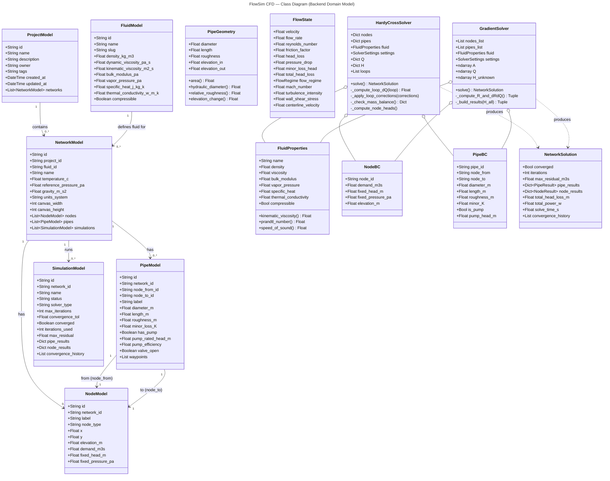

```mermaid
---
title: FlowSim CFD — Class Diagram (Backend Domain Model)
---
classDiagram
    direction TB

    %% ── Domain Entities ──────────────────────────────────────────────────────

    class ProjectModel {
        +String id
        +String name
        +String description
        +String owner
        +String tags
        +DateTime created_at
        +DateTime updated_at
        +List~NetworkModel~ networks
    }

    class NetworkModel {
        +String id
        +String project_id
        +String fluid_id
        +String name
        +Float temperature_c
        +Float reference_pressure_pa
        +Float gravity_m_s2
        +String units_system
        +Int canvas_width
        +Int canvas_height
        +List~NodeModel~ nodes
        +List~PipeModel~ pipes
        +List~SimulationModel~ simulations
    }

    class NodeModel {
        +String id
        +String network_id
        +String label
        +String node_type
        +Float x
        +Float y
        +Float elevation_m
        +Float demand_m3s
        +Float fixed_head_m
        +Float fixed_pressure_pa
    }

    class PipeModel {
        +String id
        +String network_id
        +String node_from_id
        +String node_to_id
        +String label
        +Float diameter_m
        +Float length_m
        +Float roughness_m
        +Float minor_loss_K
        +Boolean has_pump
        +Float pump_rated_head_m
        +Float pump_efficiency
        +Boolean valve_open
        +List waypoints
    }

    class FluidModel {
        +String id
        +String name
        +String slug
        +Float density_kg_m3
        +Float dynamic_viscosity_pa_s
        +Float kinematic_viscosity_m2_s
        +Float bulk_modulus_pa
        +Float vapor_pressure_pa
        +Float specific_heat_j_kg_k
        +Float thermal_conductivity_w_m_k
        +Boolean compressible
    }

    class SimulationModel {
        +String id
        +String network_id
        +String name
        +String status
        +String solver_type
        +Int max_iterations
        +Float convergence_tol
        +Boolean converged
        +Int iterations_used
        +Float max_residual
        +Dict pipe_results
        +Dict node_results
        +List convergence_history
    }

    %% ── Relationships ────────────────────────────────────────────────────────

    ProjectModel "1" --> "0..*" NetworkModel : contains
    NetworkModel "1" --> "0..*" NodeModel    : has
    NetworkModel "1" --> "0..*" PipeModel    : has
    NetworkModel "1" --> "0..*" SimulationModel : runs
    FluidModel   "1" --> "0..*" NetworkModel : defines fluid for
    PipeModel    "1" --> "1"   NodeModel     : from (node_from)
    PipeModel    "1" --> "1"   NodeModel     : to (node_to)

    %% ── Physics Dataclasses ──────────────────────────────────────────────────

    class FluidProperties {
        +String name
        +Float density
        +Float viscosity
        +Float bulk_modulus
        +Float vapor_pressure
        +Float specific_heat
        +Float thermal_conductivity
        +Bool compressible
        +kinematic_viscosity() Float
        +prandtl_number() Float
        +speed_of_sound() Float
    }

    class PipeGeometry {
        +Float diameter
        +Float length
        +Float roughness
        +Float elevation_in
        +Float elevation_out
        +area() Float
        +hydraulic_diameter() Float
        +relative_roughness() Float
        +elevation_change() Float
    }

    class FlowState {
        +Float velocity
        +Float flow_rate
        +Float reynolds_number
        +Float friction_factor
        +Float head_loss
        +Float pressure_drop
        +Float minor_loss_head
        +Float total_head_loss
        +FlowRegime flow_regime
        +Float mach_number
        +Float turbulence_intensity
        +Float wall_shear_stress
        +Float centerline_velocity
    }

    class NodeBC {
        +String node_id
        +Float demand_m3s
        +Float fixed_head_m
        +Float fixed_pressure_pa
        +Float elevation_m
    }

    class PipeBC {
        +String pipe_id
        +String node_from
        +String node_to
        +Float diameter_m
        +Float length_m
        +Float roughness_m
        +Float minor_K
        +Bool is_pump
        +Float pump_head_m
    }

    class NetworkSolution {
        +Bool converged
        +Int iterations
        +Float max_residual_m3s
        +Dict~PipeResult~ pipe_results
        +Dict~NodeResult~ node_results
        +Float total_head_loss_m
        +Float total_power_w
        +Float solve_time_s
        +List convergence_history
    }

    %% ── Solver classes ───────────────────────────────────────────────────────

    class HardyCrossSolver {
        +Dict nodes
        +Dict pipes
        +FluidProperties fluid
        +SolverSettings settings
        +Dict Q
        +Dict H
        +List loops
        +solve() NetworkSolution
        -_compute_loop_dQ(loop) Float
        -_apply_loop_corrections(corrections)
        -_check_mass_balance() Dict
        -_compute_node_heads()
    }

    class GradientSolver {
        +List nodes_list
        +List pipes_list
        +FluidProperties fluid
        +SolverSettings settings
        +ndarray A
        +ndarray Q
        +ndarray H_unknown
        +solve() NetworkSolution
        -_compute_R_and_dRdQ() Tuple
        -_build_results(H_all) Tuple
    }

    HardyCrossSolver ..> NetworkSolution : produces
    GradientSolver   ..> NetworkSolution : produces
    HardyCrossSolver o-- FluidProperties
    GradientSolver   o-- FluidProperties
    HardyCrossSolver o-- NodeBC
    HardyCrossSolver o-- PipeBC
    GradientSolver   o-- NodeBC
    GradientSolver   o-- PipeBC
```
