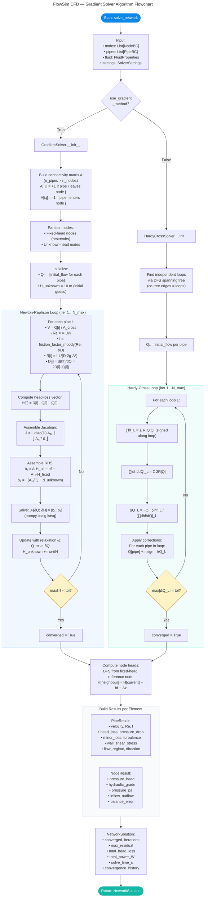

```mermaid
---
title: FlowSim CFD — Gradient Solver Algorithm Flowchart
---
flowchart TD
    START([Start: solve_network]) --> INPUT

    INPUT["Input:\n• nodes: List[NodeBC]\n• pipes: List[PipeBC]\n• fluid: FluidProperties\n• settings: SolverSettings"]

    INPUT --> CHOOSE{use_gradient\n_method?}

    CHOOSE -->|True| GRAD[GradientSolver.__init__]
    CHOOSE -->|False| HC[HardyCrossSolver.__init__]

    %% ── Gradient Method ──────────────────────────────────────────────────────

    GRAD --> GBUILD["Build connectivity matrix A\n(n_pipes × n_nodes)\nA[i,j] = +1 if pipe i leaves node j\nA[i,j] = -1 if pipe i enters node j"]
    GBUILD --> GPART["Partition nodes:\n• Fixed-head nodes (reservoirs)\n• Unknown-head nodes"]
    GPART --> GINIT["Initialize:\n• Q₀ = [initial_flow for each pipe]\n• H_unknown = 10 m (initial guess)"]
    GINIT --> GLOOP

    subgraph GLOOP["Newton-Raphson Loop (iter 1…N_max)"]
        direction TB
        G1["For each pipe i:\n• V = Q[i] / A_cross\n• Re = V·D/ν\n• f = friction_factor_moody(Re, ε/D)\n• R[i] = f·L/(D·2g·A²)\n• D[i] = d(hf)/dQ = 2R[i]·|Q[i]|"]
        G1 --> G2["Compute head-loss vector:\nhf[i] = R[i] · Q[i] · |Q[i]|"]
        G2 --> G3["Assemble Jacobian:\nJ = ⎡ diag(D)   A₁₁ ⎤\n    ⎣  A₁₁ᵀ    0  ⎦"]
        G3 --> G4["Assemble RHS:\nb₁ = A·H_all − hf − A₁₂·H_fixed\nb₂ = −(A₁₁ᵀQ − d_unknown)"]
        G4 --> G5["Solve: J·[δQ; δH] = [b₁; b₂]\n(numpy.linalg.lstsq)"]
        G5 --> G6["Update with relaxation ω:\nQ += ω·δQ\nH_unknown += ω·δH"]
        G6 --> GCONV{"max‖r‖ < tol?"}
        GCONV -->|No| G1
        GCONV -->|Yes| GOUT["converged = True"]
    end

    %% ── Hardy-Cross Method ───────────────────────────────────────────────────

    HC --> HCFIND["Find independent loops\nvia DFS spanning tree\n(co-tree edges = loops)"]
    HCFIND --> HCINIT["Q₀ = initial_flow per pipe"]
    HCINIT --> HCLOOP

    subgraph HCLOOP["Hardy-Cross Loop (iter 1…N_max)"]
        direction TB
        HC1["For each loop L:"]
        HC2["∑hf_L = Σ R·Q|Q| (signed along loop)"]
        HC3["∑|dhf/dQ|_L = Σ 2R|Q|"]
        HC4["ΔQ_L = −ω · ∑hf_L / ∑|dhf/dQ|_L"]
        HC5["Apply corrections:\nFor each pipe in loop:\nQ[pipe] += sign · ΔQ_L"]
        HCCONV{"max|ΔQ_L| < tol?"}

        HC1 --> HC2 --> HC3 --> HC4 --> HC5 --> HCCONV
        HCCONV -->|No| HC1
        HCCONV -->|Yes| HCOUT["converged = True"]
    end

    %% ── Post-processing ──────────────────────────────────────────────────────

    GOUT --> POST
    HCOUT --> POST

    POST["Compute node heads:\nBFS from fixed-head reference node\nH[neighbour] = H[current] − hf − Δz"]

    POST --> RESULTS

    subgraph RESULTS["Build Results per Element"]
        direction LR
        PR["PipeResult:\n• velocity, Re, f\n• head_loss, pressure_drop\n• minor_loss, turbulence\n• wall_shear_stress\n• flow_regime, direction"]
        NR["NodeResult:\n• pressure_head\n• hydraulic_grade\n• pressure_pa\n• inflow, outflow\n• balance_error"]
    end

    RESULTS --> NSOL["NetworkSolution:\n• converged, iterations\n• max_residual\n• total_head_loss\n• total_power_W\n• solve_time_s\n• convergence_history"]

    NSOL --> DONE([Return NetworkSolution])

    %% ── Styling ──────────────────────────────────────────────────────────────

    style START fill:#0e87ea,color:#fff,stroke:none
    style DONE  fill:#14b8a6,color:#fff,stroke:none
    style GCONV fill:#fef3c7,stroke:#d97706
    style HCCONV fill:#fef3c7,stroke:#d97706
    style GLOOP fill:#f0f7ff,stroke:#baddfd
    style HCLOOP fill:#f0fdfa,stroke:#99f6e4
    style RESULTS fill:#f8fafc,stroke:#e2e8f0
```
